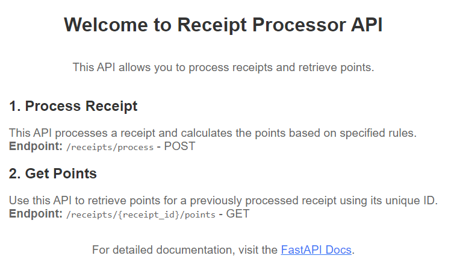
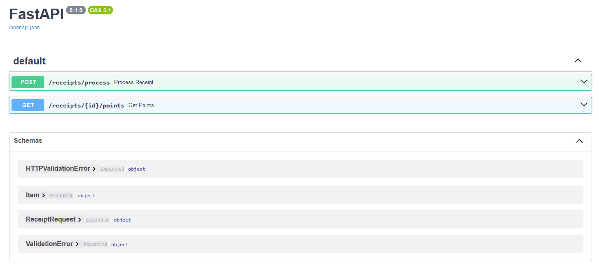
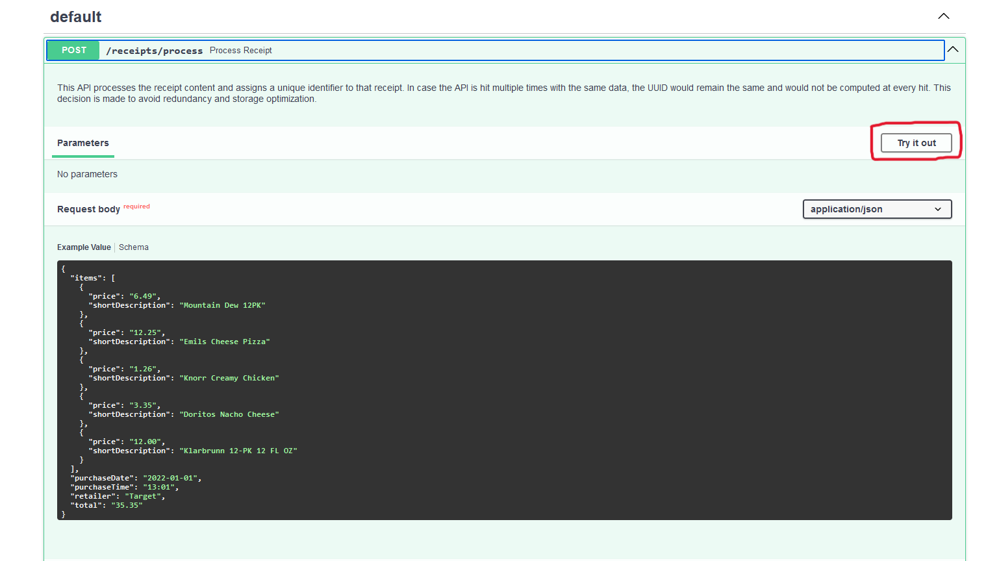
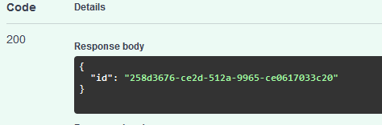
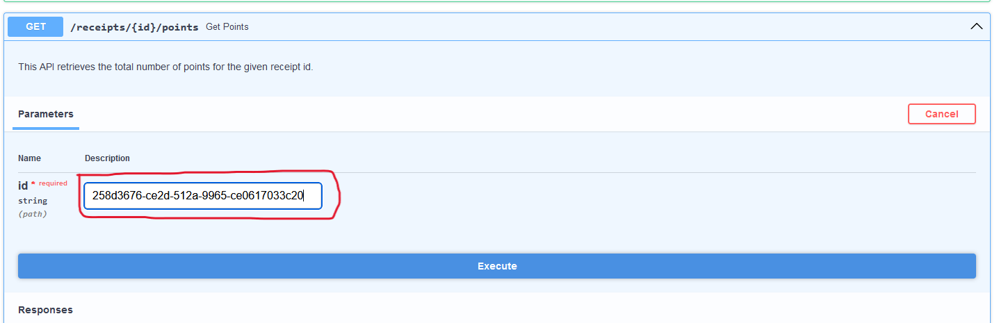
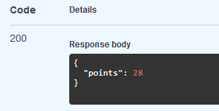

# Receipt Processor

The Receipt Processor API is a FastAPI-based application designed to process receipts and calculate reward points based on specific rules. It provides endpoints for submitting receipt data, and retrieving reward points for processed receipts.

## Prerequisites
Before using the Receipt Processor API, ensure that you have the following prerequisites installed on your system:

**Docker**: Docker is used for containerization. This tutorial assumes that the Docker is already installed on the system of the evaluator. If not, it can be installed from Docker's official website https://docs.docker.com/get-docker/.

**Python (Optional)**: The project is built using Python. If you want to run the application without using Docker, Python needs to be installed. Install Python from python.org if not already installed.

## Getting Started
Follow the steps below to get started with the Receipt Processor API:

### Clone the Repository:


```
git clone Parth09P/Receipt-Processor
cd Receipt-Processor
```
### Running the application:

**Option 1:** Running the Application with Docker Image:
```
docker pull parth09p/receipt-processor      
docker run -p 8000:8000  parth09p/receipt-processor 
```

**Option 2:** Running the Application with Docker:
```
docker build -t receipt-processor .
docker run -p 8000:8000 receipt-processor
```
Here, *receipt-processor* is the image-name. Any suitable name can be used.

**Option 3:** Running the Application with FastAPI (requires Python to be installed):
```
# Setting a virtual environment is optional
python -m venv venv
source venv/bin/activate  # On Windows, use "venv\Scripts\activate"
```
```
pip install -r requirements.txt
uvicorn main:app --reload
```

### Access the API:
Open your web browser and navigate to http://127.0.0.1:8000/docs to access the FastAPI documentation and explore the available APIs.

### Stopping the Application
- If running without Docker, press Ctrl+C in the terminal.
- If running with Docker, stop the Docker container using docker stop *container-id*.

## API Endpoints

### 1. Process Receipt API

This API processes a receipt and calculates reward points based on specified rules.

- **Endpoint:** `/receipts/process` - POST

#### Request Example

```
{
  "retailer": "Target",
  "purchaseDate": "2022-01-01",
  "purchaseTime": "13:01",
  "items": [
    {"shortDescription": "Mountain Dew 12PK", "price": "6.49"},
    {"shortDescription": "Emils Cheese Pizza", "price": "12.25"},
    {"shortDescription": "Knorr Creamy Chicken", "price": "1.26"},
    {"shortDescription": "Doritos Nacho Cheese", "price": "3.35"},
    {"shortDescription": "Klarbrunn 12-PK 12 FL OZ", "price": "12.00"}
  ],
  "total": "35.35"
}
```

#### Response Example

```
{
  { "id": "7fb1377b-b223-49d9-a31a-5a02701dd310" }
}
```

### 2. Get Points API

Use this API to retrieve points for a previously processed receipt using its unique ID.

- **Endpoint:** `/receipts/{id}/points` - GET

### Request Example

#### Request Example

```
  { "id": "7fb1377b-b223-49d9-a31a-5a02701dd310" }
```
The above is a receipt ID that was generated by Process Receipt API. This ID needs to be passed to Get Points API.

#### Response Example
```
{
  { "points": "28" }
}
```

### Usage:
- This is the home page of the application. Navigate to http://127.0.0.1:8000/docs to access the APIs.


- This is the Swagger UI (OpenAPI). Click on the first **Process Receipt API's** dropdown.


- An example has already been pre-loaded for convenience. Select 'Try it out', then click on 'Execute'.


- After clicking on execute, a response should be generated below. Following is an example of a successful response with a unique ID. For storage optimization purposes, hitting the API multiple times with the same input data would generate the same UUID each time to avoid unnecessary redundancy.


- Copy the unique ID generated and paste it in the second **Get Points API**.


- After executing the Get Points API, the points associated with the provided ID would be shown as the response. If the UUID does not exist yet, a response stating *No receipt found for that ID* will be shown.


### Known issues:
- If the application is run through Docker, the log states that the application could be accessed through http://0.0.0.0:8000. But, clicking on this link results in a *Site not found* error. http://127.0.0.1:8000 should be used instead.
```
INFO:     Uvicorn running on http://0.0.0.0:8000 (Press CTRL+C to quit)
```

- Another known issue is with the validations. Although distinct validations have been added in the codebase to check for incorrect receipts, they are not  individually handled. Rather, any invalid receipt object is handled as *The receipt is invalid*. 
